# 🛒 FreshCart – Smart Grocery Management System

FreshCart is a modern grocery shopping web application built with **React.js** for the frontend and **Node.js + Express.js** for the backend (currently under development). The project provides a seamless shopping experience for customers along with a dedicated admin dashboard for store management.

---

## ✨ Features

### 👤 User Side

* Browse all grocery products
* Search, filter, and sort products
* Product details page
* Shopping cart management
* Wishlist functionality
* User Login & Registration UI
* Responsive design for desktop and mobile

### 👨‍💼 Admin Side

* Secure Admin Login UI
* Dashboard with statistics and charts
* Add new products
* Edit existing products
* Delete products
* Manage orders
* Manage users
* Protected admin routes

---

## 🛠️ Tech Stack

**Frontend**

* React.js (Create React App)
* React Router DOM
* React Toastify
* React Icons
* Recharts
* CSS3

**Backend (In Progress)**

* Node.js
* Express.js
* MongoDB
* Mongoose
* JWT Authentication

---

## 📂 Project Structure

```
FreshCart/
│
├── freshcart-frontend/
│   ├── src/
│   ├── public/
│   └── package.json
│
└── freshcart-backend/
    ├── config/
    ├── controllers/
    ├── middleware/
    ├── models/
    ├── routes/
    └── server.js
```
---

# 📸 Screenshots

## 🏠 Home Page

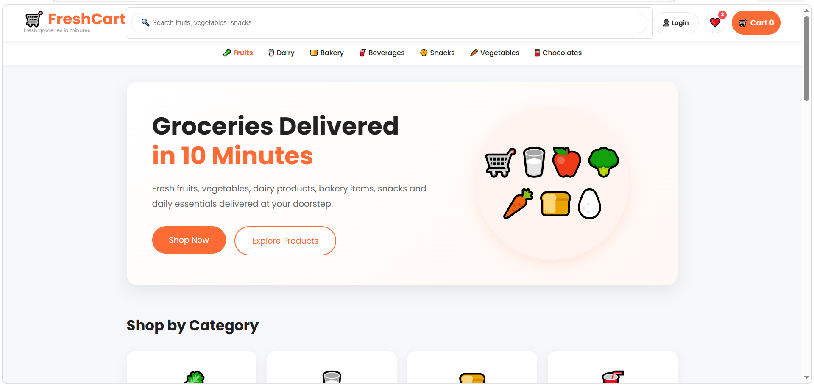

---

## 🛍️ Products Page

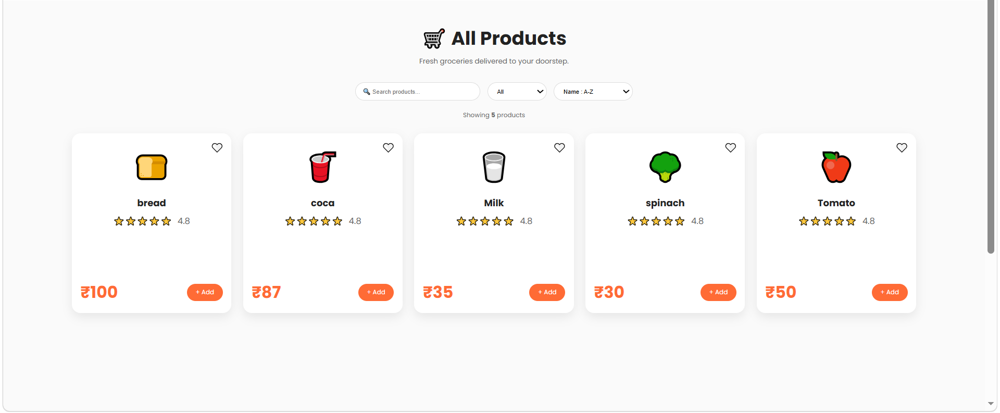

---


## ❤️ Wishlist

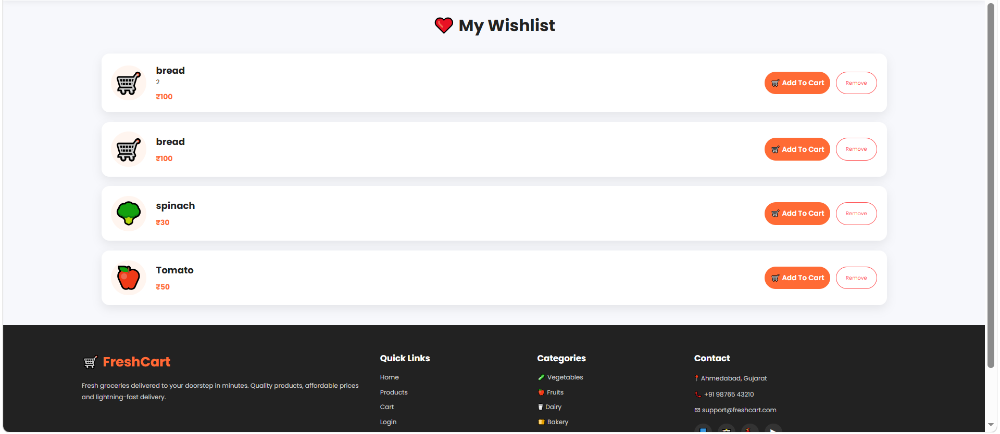

---

## 🛒 Shopping Cart

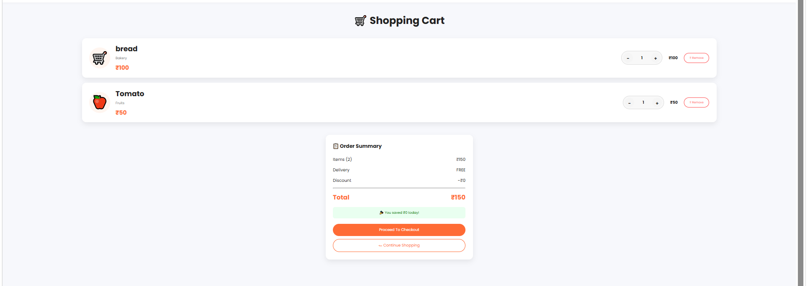

---

## 🔐 User Login


---

## 📝 User Registration


---

## 🔑 Admin Login

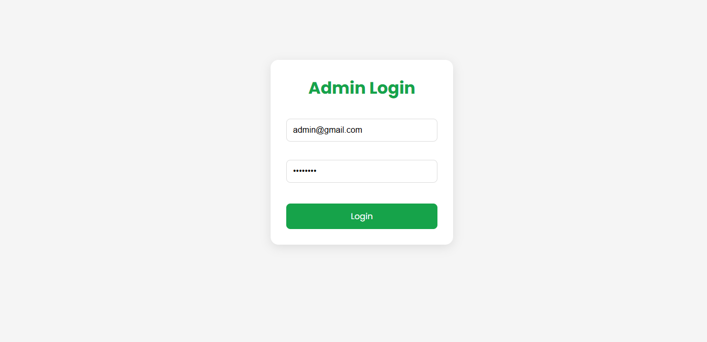

---

## 📊 Admin Dashboard

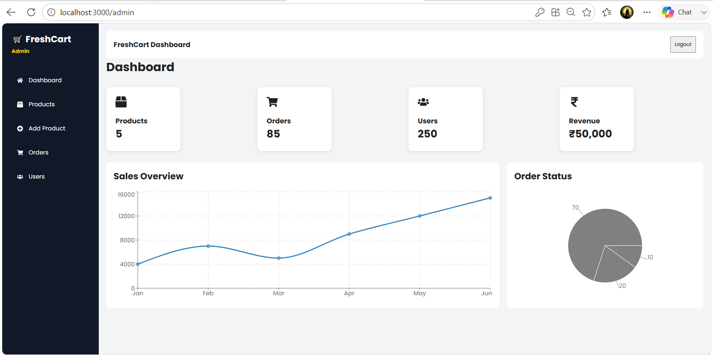

---

## 📦 Manage Products

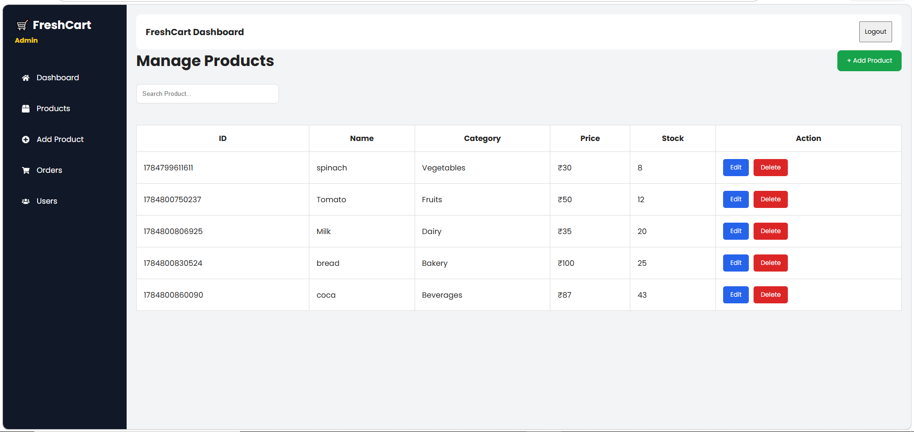

---

## ➕ Add Product

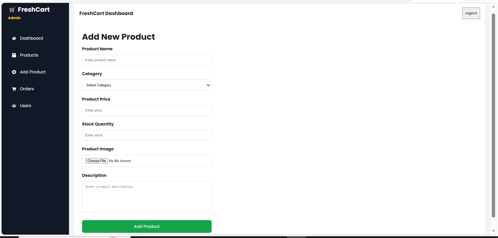

---

## ✏️ Edit Product

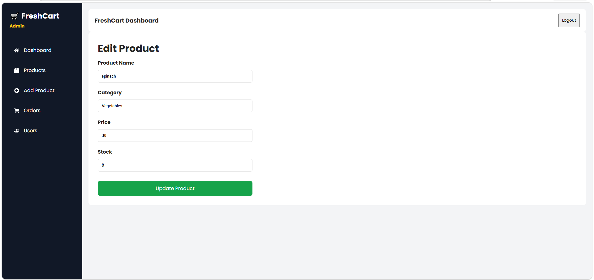

---

## 📋 Manage Orders

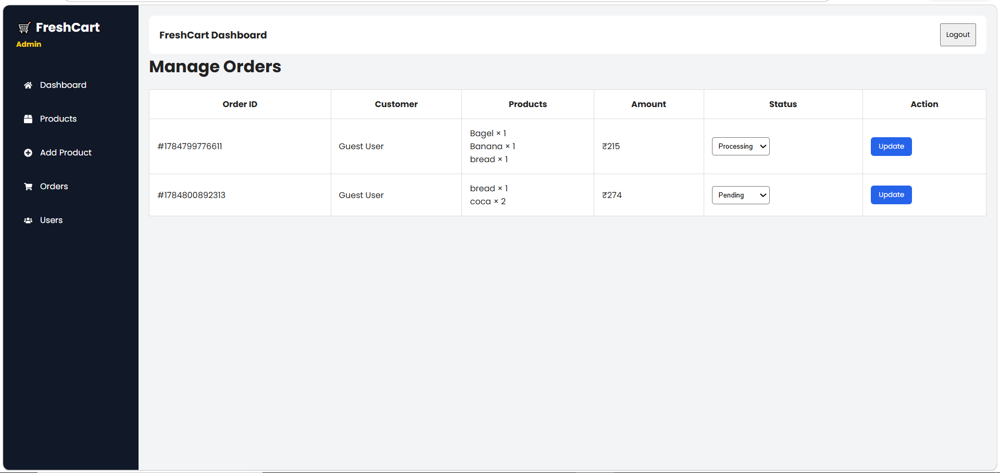

---

## 👥 Manage Users

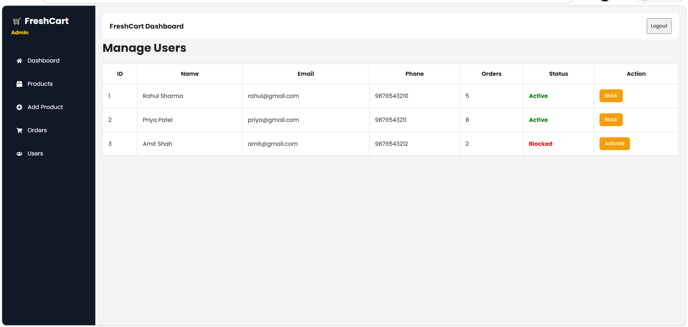

---
---

## 🚀 Current Status

### ✅ Completed

* User Interface
* Product Catalog
* Cart & Wishlist
* Admin Dashboard UI
* Product CRUD functionality (frontend state)
* Order Management UI
* User Management UI
* Admin Authentication (frontend)
* Responsive Admin Layout

### 🚧 Backend Pending / Under Development

* MongoDB database connection
* REST API integration
* JWT authentication with backend
* Product image upload API
* Order processing APIs
* Connecting frontend with backend services

---

## 📌 Note

This repository currently contains the **complete frontend implementation** and the **initial backend structure**. The backend APIs and database integration are being developed and will be connected to the frontend in the next phase of the project.

---

## 👩‍💻 Author

**Asmita Rathod**

Information Technology Student | Full Stack Web Development Enthusiast

⭐ If you found this project interesting, consider giving it a **Star** on GitHub!
